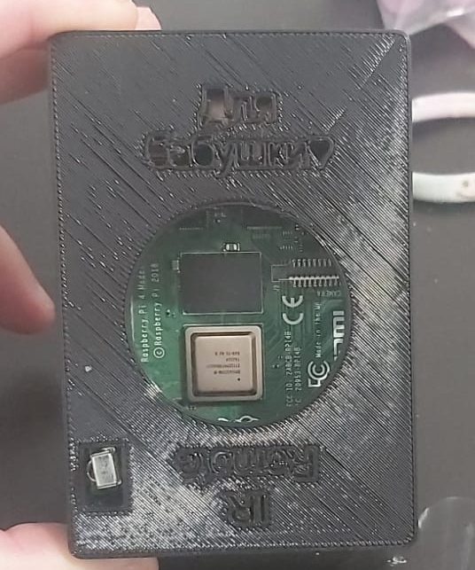

## A remote controller for the elderly

## The problem

My grandma has lived for the couple last years all by herself in her apartment (After my grandfather passed away).
The days passed slowly as she tried to find any kind of entertainment, be it books or TV shows. However, she has already watched
pretty much everything that she could find on TV.

After upgrading here TV to a smart TV we tried several times to teach her how to watch recorded series that we downloaded for here.
We tried for a couple of weeks but at last gave up :(

- [ ] The fear

The biggest problem in teaching my grandma how to use the smart TV was the lingering feat that she will break the TV and end without the downloaded series and without the cables.

This fear was all she could think about and wasn't open to learning how to use the TV.

- [ ] The tech

Understanding the basic concepts of an interactive screen were very hard for here. Be it the fact that you can change screens, that there are selected areas or just the eye hand coordination of  using the remote and looking at the screen were to much.

## The solution

A custom __easy to use__ streaming device powered by Raspberry Pie.

- [x] The Fear

Instead of tinkering with the TV input sources and configuration I decided to out source the problem and buy and HDMI splitter.
For 10$ I bought a very good [HDMI splitter](https://www.aliexpress.com/item/32968528447.html?spm=a2g0o.productlist.0.0.d14d25dbiIts0T&algo_pvid=dc94d4b5-a701-400a-9553-aead6fbb13f5&algo_exp_id=dc94d4b5-a701-400a-9553-aead6fbb13f5-0&pdp_ext_f=%7B%22sku_id%22%3A%2212000027261805370%22%7D&pdp_pi=-1%3B35.44%3B-1%3B-1%40salePrice%3BILS%3Bsearch-mainSearch) which has the perfect UX for the job - A big round button :) 

With this design she can be **calm** as she knows that the cables are just a click away and decoupled from the new system.

- [x] The Tech

The main problem that my grandma has was all of the changing screens and understanding which part of the screen is currently selected.
Both tasks are irrelevant to the main task - Starting the stream the relevant episode.

In order to simplify the UX as much as possible I decided on the following design:

1. Pressing the episodes number will start playing that episode - No matter the current state of the system
2. There will be quite a long waiting time for multi numbered episodes.
3. Added optional features like pausing and rewinding which are **optional**.

### The hardware

There really isn't much the say here.
you will need 

1. 1x raspberry pie - preferable with support for 4K video streaming
2. 1x IR receiver 
3. 1x IR remote - any old TV remote will do.

## A little bit about the implementation

### Linux event handler for the win

In contrary to my expectations receiving and handling IR signals is much much harder than it should be.
...

### Python vlc adapter

....

